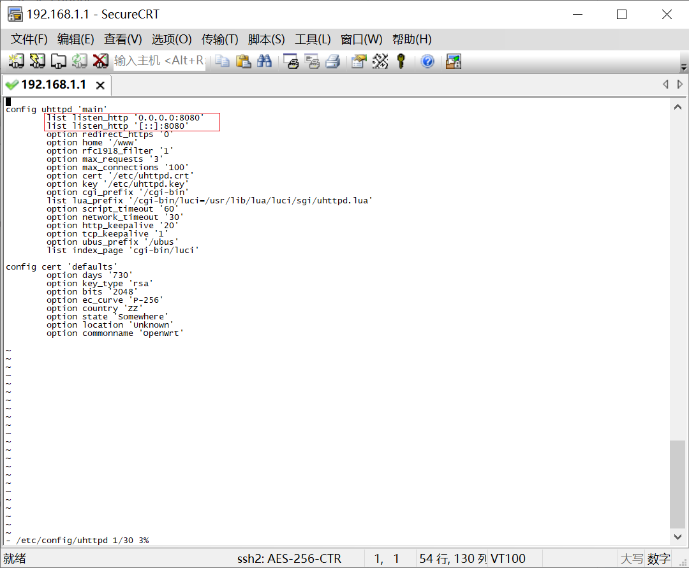
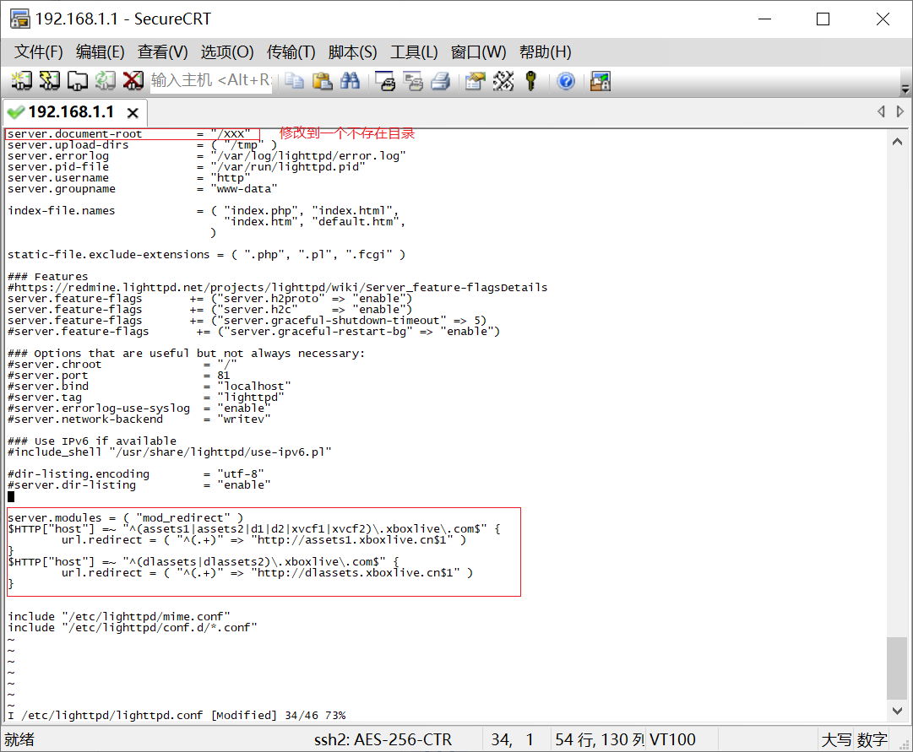
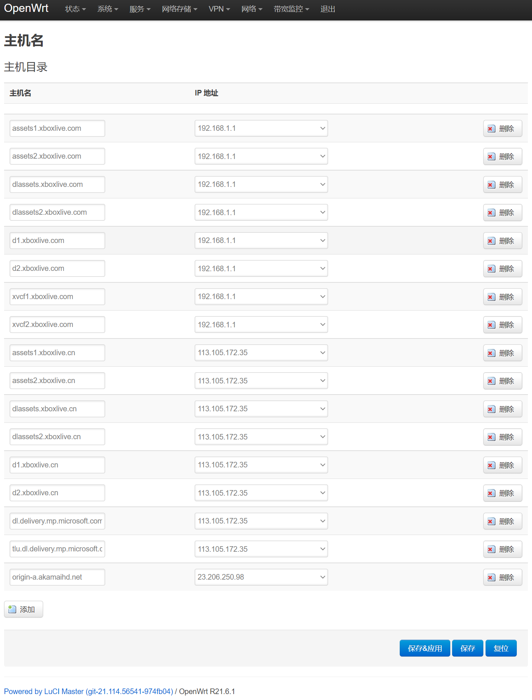
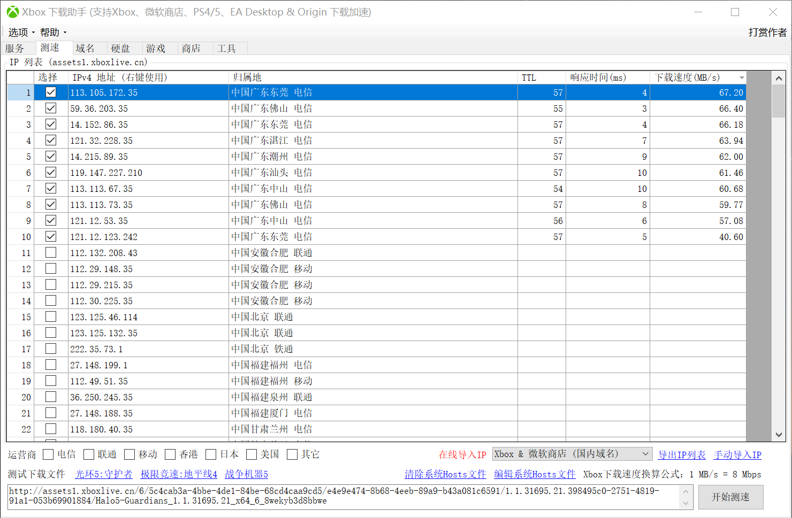
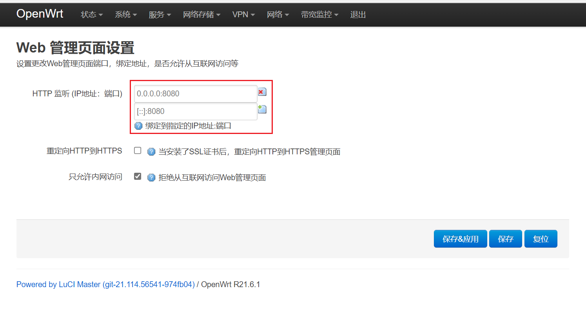
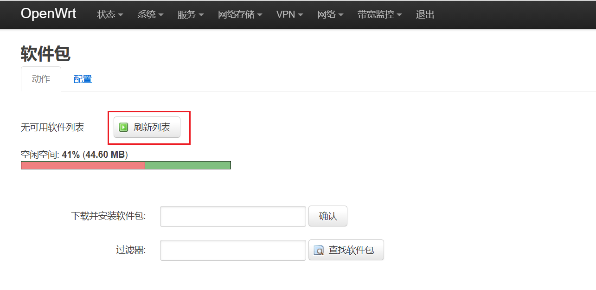
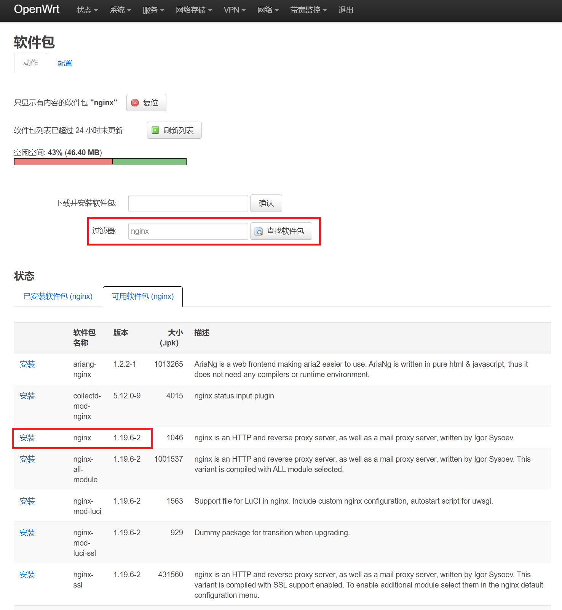
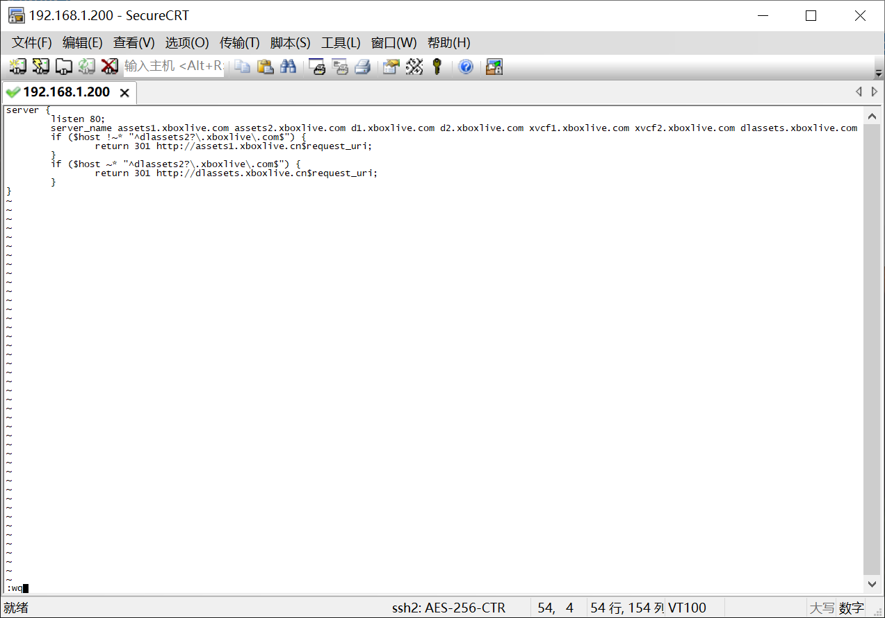
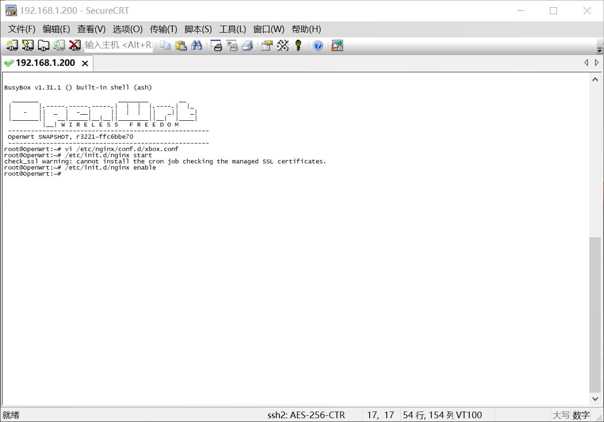

# OpenWrt 安装 Lighttpd 或者 Nginx，使用URL重写跳转国内CDN服务器加速下载

提速原理请参考PC [Xbox下载助手](https://github.com/skydevil88/XboxDownload "Xbox下载助手")，同时支持PC微软商店加速。
其它路由器如果能安装 [Lighttpd](#方法一lighttpd "Lighttpd") 或者 [Nginx](#方法二nginx "Lighttpd") 也可以按照教程操作。
小米等支持改 Hosts 路由器可以同时把 com 和 cn 下载域名测速后找出最快 IP 写进 Hosts 中，这样子不管 Xbox 用那个域名下载都能加速。 

Xbox使用此方法需要关闭路由器IPv6功能，如果有其它设备需要用到IPv6，可以在 网络->防火墙->自定义规则 中添加以下两条规则屏蔽掉Xbox的IPv6地址。（XBOX_MAC替换成Xbox Mac地址，地址之间要用“:”号分隔，不能用“-”）
```bash
ip6tables -I INPUT -p icmpv6 -m mac --mac-source XBOX_MAC -j DROP 
ip6tables -I INPUT -p udp -m mac --mac-source XBOX_MAC --dport 547 -j DROP
```

## 方法一：Lighttpd 
1. 修改uhttpd端口（修改后进入OpenWrt管理页面要用 192.168.1.1:8080）
```bash
vi /etc/config/uhttpd
#按 i 进入编辑模式，
list listen_http '0.0.0.0:80' --> list listen_http '0.0.0.0:8080
list listen_http '[::]:80' --> list listen_http '[::]:8080'
#按ESC键 跳到命令模式，然后输入 :wq 保存文件并退出vi, 重启uhttpd
/etc/init.d/uhttpd restart
```


2.安装 lighttpd
```bash
opkg update
opkg install lighttpd lighttpd-mod-redirect
```

3.配置 lighttpd
```bash
vi /etc/lighttpd/lighttpd.conf
#按 i 进入编辑模式，然后复制下面代码，Shift+Inset 粘贴，按ESC键 跳到命令模式，然后输入 :wq 保存文件并退出vi
server.modules = ( "mod_redirect" )
$HTTP["host"] =~ "^(assets1|assets2|d1|d2|xvcf1|xvcf2)\.xboxlive\.com$" {
	url.redirect = ( "^(.+)" => "http://assets1.xboxlive.cn$1" )
}
$HTTP["host"] =~ "^(dlassets|dlassets2)\.xboxlive\.com$" {
	url.redirect = ( "^(.+)" => "http://dlassets.xboxlive.cn$1" )
}

#启动lighttpd服务以及设置其开机自启
/etc/init.d/lighttpd start
/etc/init.d/lighttpd enable
#重启lighttpd
/etc/init.d/lighttpd restart
```


4.打开OpenWrt管理页(http://192.168.1.1:8080) 网络-》主机名 ，添加 主机名：
```bash
assets1.xboxlive.com			192.168.1.1
assets2.xboxlive.com			192.168.1.1
dlassets.xboxlive.com			192.168.1.1
dlassets2.xboxlive.com			192.168.1.1
d1.xboxlive.com				192.168.1.1
d2.xboxlive.com				192.168.1.1
xvcf1.xboxlive.com			192.168.1.1	#PC微软商店使用
xvcf2.xboxlive.com			192.168.1.1	#PC微软商店使用

#113.105.172.35是广东省东莞市电信cdn，不一定适合你使用，可以使用下载助手测速找出自己最快IP
assets1.xboxlive.cn			113.105.172.35	#主要
assets2.xboxlive.cn			113.105.172.35	#可选
dlassets.xboxlive.cn			113.105.172.35	#主要
dlassets2.xboxlive.cn			113.105.172.35	#可选
d1.xboxlive.cn				113.105.172.35	#可选
d2.xboxlive.cn				113.105.172.35	#可选
dl.delivery.mp.microsoft.com		113.105.172.35	#应用下载
tlu.dl.delivery.mp.microsoft.com	113.105.172.35	#应用下载
origin-a.akamaihd.net			23.206.250.98	#PC EA Desktop & Origin CDN
```





最后在浏览器中输入 assets1.xboxlive.com/1234 (1234为随机字符，避免浏览器缓存), 看到地址变成 assets1.xboxlive.cn/1234 表示成功跳转到cn，接着打开你的Xbox又能愉快地下载。


## 方法二：Nginx	
1. 修改uhttpd端口, 这次用管理页面直接修改(系统->Web管理)，端口改为8080保存重启。


2. 重启后选择 系统->软件包，刷新列表，过滤器中输入 nginx 查找，找到后安装 nginx。



3. SSH连进路由器
```bash
vi /etc/nginx/conf.d/xbox.conf
#按 i 进入编辑模式，然后复制下面代码，Shift+Inset 粘贴，按ESC键 跳到命令模式，然后输入 :wq 保存文件并退出vi
server {
        listen 80;
        server_name assets1.xboxlive.com assets2.xboxlive.com d1.xboxlive.com d2.xboxlive.com xvcf1.xboxlive.com xvcf2.xboxlive.com dlassets.xboxlive.com dlassets2.xboxlive.com;
        if ($host !~* "^dlassets2?\.xboxlive\.com$") {
                return 301 http://assets1.xboxlive.cn$request_uri;
        }
        if ($host ~* "^dlassets2?\.xboxlive\.com$") {
                return 301 http://dlassets.xboxlive.cn$request_uri;
        }
}

#启动 nginx 服务以及设置其开机自启，显示证书警告信息可以不理会。
/etc/init.d/nginx start
/etc/init.d/nginx enable
#重启nginx
/etc/init.d/nginx restart
```



4.打开OpenWrt管理页(http://192.168.1.1:8080) 网络-》主机名 ，添加 主机名：
```bash
assets1.xboxlive.com			192.168.1.1
assets2.xboxlive.com			192.168.1.1
dlassets.xboxlive.com			192.168.1.1
dlassets2.xboxlive.com			192.168.1.1
d1.xboxlive.com				192.168.1.1
d2.xboxlive.com				192.168.1.1
xvcf1.xboxlive.com			192.168.1.1	#PC微软商店使用
xvcf2.xboxlive.com			192.168.1.1	#PC微软商店使用

#113.105.172.35是广东省东莞市电信cdn，不一定适合你使用，可以使用下载助手测速找出自己最快IP
assets1.xboxlive.cn			113.105.172.35	#主要
assets2.xboxlive.cn			113.105.172.35	#可选
dlassets.xboxlive.cn			113.105.172.35	#主要
dlassets2.xboxlive.cn			113.105.172.35	#可选
d1.xboxlive.cn				113.105.172.35	#可选
d2.xboxlive.cn				113.105.172.35	#可选
dl.delivery.mp.microsoft.com		113.105.172.35	#应用下载
tlu.dl.delivery.mp.microsoft.com	113.105.172.35	#应用下载
origin-a.akamaihd.net			23.206.250.98	#PC EA Desktop & Origin CDN
```


最后在浏览器中输入 assets1.xboxlive.com/1234 (1234为随机字符，避免浏览器缓存), 看到地址变成 assets1.xboxlive.cn/1234 表示成功跳转到cn，接着打开你的Xbox又能愉快地下载。

## 方法三：IIS	
https://tieba.baidu.com/p/7151558145


